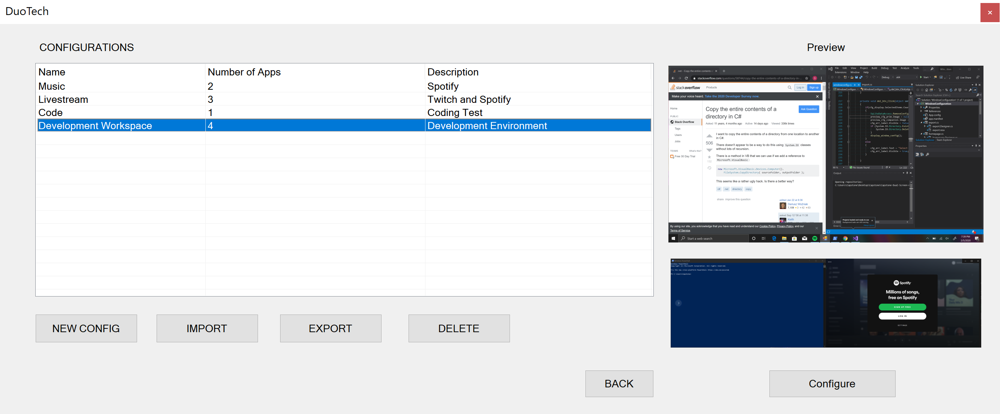
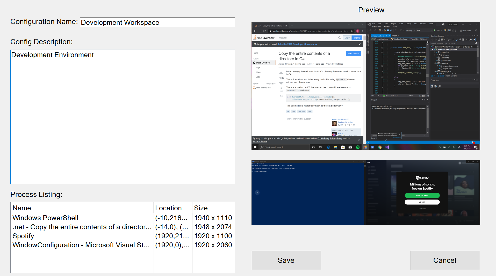

# Dual Screen Laptop Application
This is a repo for the dual screen laptop application designed and created by
capstone team 66a at Oregon State for the ZenBook Pro Duo laptop.

# Install and Run Instructions/Help
Instructions for using the application can be found in the HELP.md file [here](https://github.com/roseg31/Capstone-Dual-Screen-App/blob/master/HELP.md). 

# Documentation
Documentation for this project can be viewed by visiting the path *Capstone-Dual-Screen-App-master\Documentation*. This includes all technical documents from Fall, Winter and Spring.

# Introduction
The Asus ZenBook Pro Duo is a new paradigm in laptop computing. While having multiple monitors have become common, the idea of having multiple screens on a mobile device such as a laptop is a relatively new idea. The Asus ZenBook Pro Duo is one of the first multi-screen portable devices on the market and as such, faces some interesting challenges. 

About the ZenBook Pro Duo:
* CPU: Intel Core I9-9980HK
* GPU: NVIDIA GeForce RTX 2060
* Memory: 16/32GB 2666Mhz DDR4
* OS: Windows 10
* 4K UHD NanoEdge OLED HDR touchscreen display
* 4K UHD NanoEdge OLED HDR ScreenPad Plus companion display

The ZenBook Pro Duo comes with various pre-installed applications and tools to support the companion screen. However, these tools are relatively basic and don’t provide enough utility for users. 
To combat this issue, the goal of the Duo Tech project is to develop an application to enhance the user experience of the ZenBook companion screen as well as innovate tools that might be used in forthcoming dual screen systems.

# Project Description
This product originates from the need to develop more software that utilize the capabilities of dual and companion screen systems to enhance the user experience on these new types of devices. While multi-monitor technology has been available for quite some time, the functionality has always been fairly limited. This product will upend the normal use of the second monitor and give the user something truly unique in using the advanced hardware capabilities. The product will rely heavily on the companion monitor technology and focus on the functionality between two touch screen monitors.

We developed our application using Visual Studio’s C# .NET Window Forms framework. This product is tailored towards individuals who want to have more freedom in how they manage various windows in their workspace. 

The application is used by first taking a screenshot of all the currently used screens and displaying the foreground windows that are present within each screenshot. The user then has the ability to save this configuration to their local SQLite database to be used at a later time. When the user loads a custom configuration, all windows that were previously stored in the database will resize and move based on the specified location and size.

# Results
* Auto-detection of foreground window position and window size.
* One click functionality to load a configuration on a system.
* DPI awareness allowing the application to adjust the location and size regardless of resolution or zoom percentage.
* Reduced storage overhead by utilizing a local SQLite database to store configuration information.
* Provided the ability for users to export and import custom window configurations.

# Looking Forward
Our main goal throughout the project was to develop a verbose tool that can help accommodate both screens of the ZenBook Pro Duo. We found that creating a window manager was a lot more difficult than we originally thought because of the limitations Microsoft allows for third-party applications. 

Looking forward, this project can be taken in a variety of different directions and we know that window management applications are a major attraction in the multi-screen market. In the future, we would like to expand this application by adding:

* The ability to adjust the aspect ratio of occupied screens to increase visibility of various windows.
* Custom window configurations within a single application (Ex: Adobe Photoshop).
* A TechDuo website that can host users’ configurations for easier sharing and uploading.

# Images

**Figure 1:** Our window configuration application that allows users to create and share new workspaces.

**Figure 2:** Configuration setup page for a particular workspace.

# Video Overview

https://youtu.be/O5wquz2LYHY
1. 0:00 - Project Overview
2. 1:03 - Technical Overview
3. 9:11 - UI Overview
4. 15:17 - Live Demo

# Changelog (Code Review Feedback)
* Changed button colors to indicate when they are enabled or disabled.
* Added more comments and refactored long functions.
* Added a FAQ entry that indicates that the software is only available for Windows users
* Moved executables and binary files to different location
